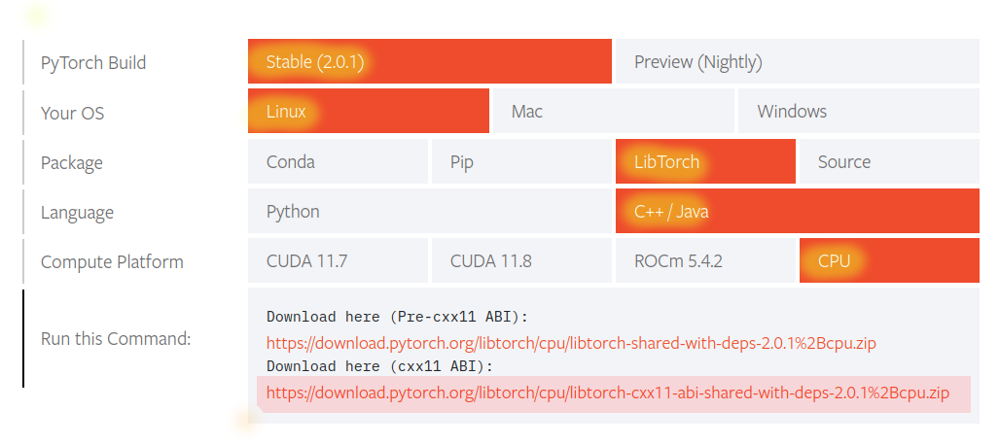

# CV_TRAY_DETECTION
A computer vision project for detection of food waste in a tray.
The project is based on:
-Resnet34 fine tuned
-OpenCV

## Installation
To clone the repository use the following command:
```bash
git clone https://github.com/gp-1108/CV_Tray_Detection.git
```

## Dependencies
The project requires the following dependencies:
* OpenCV
* LibTorch

Download and install OpenCV from [here](https://docs.opencv.org/4.x/d7/d9f/tutorial_linux_install.html).

For LibTorch download the zip file from [here](https://pytorch.org/get-started/locally/).
<br/><br/>
<strong> !!! ATTENTION !!! </strong>
<br/>
The project is built with the ```cxx11 ABI``` and is meant to be run on the CPU.
Make sure to download the correct version of LibTorch. Look at the image below for reference.


Once you have extracted your zip file you should have a folder named ```libtorch```.
Now you have two options:
1. Copy the folder in the project root directory
2. Specify the path to the folder while building the project (see build section)

## Building
If you have moved the libtorch folder in the project root directory use the following commands:
```bash
mkdir build && cd build
cmake ..
cmake --build .
```

Otherise if you have moved the libtorch folder somewhere else use the following commands:
```bash
mkdir build && cd build
cmake -DCMAKE_PREFIX_PATH=<path_to_libtorch> ..
cmake --build .
```

## Usage
The model is already loaded in the project, so to run the project use the following command:
```bash
./src/model_example model.pth <path_to_image>
```

